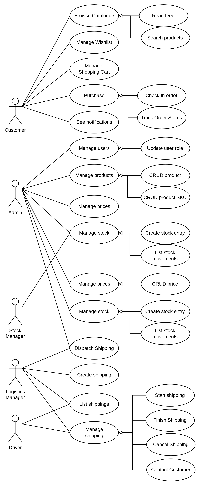
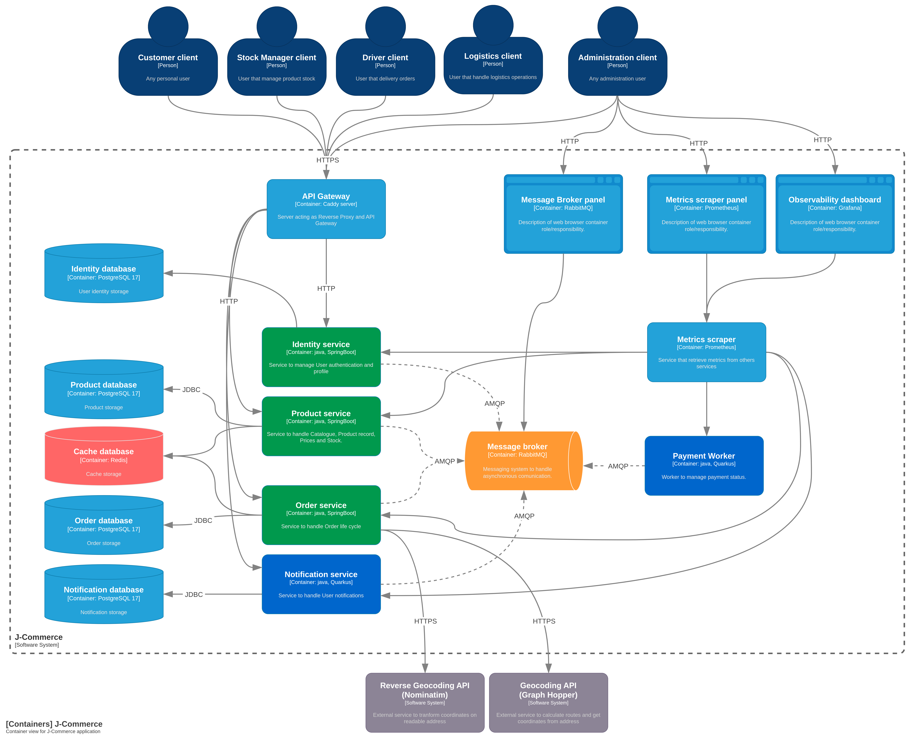
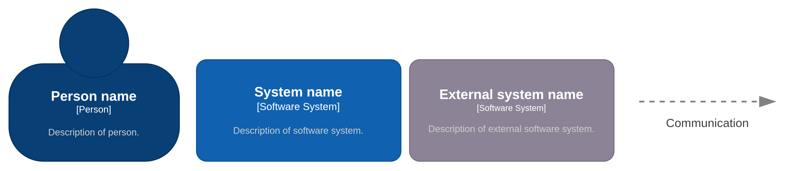
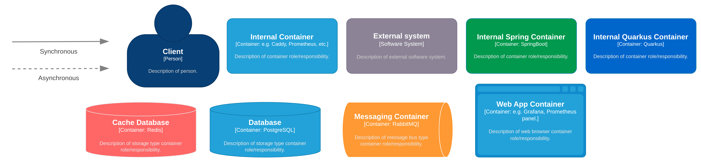
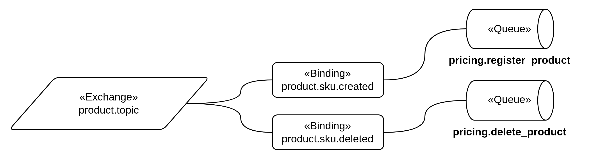
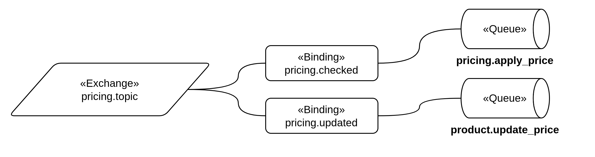
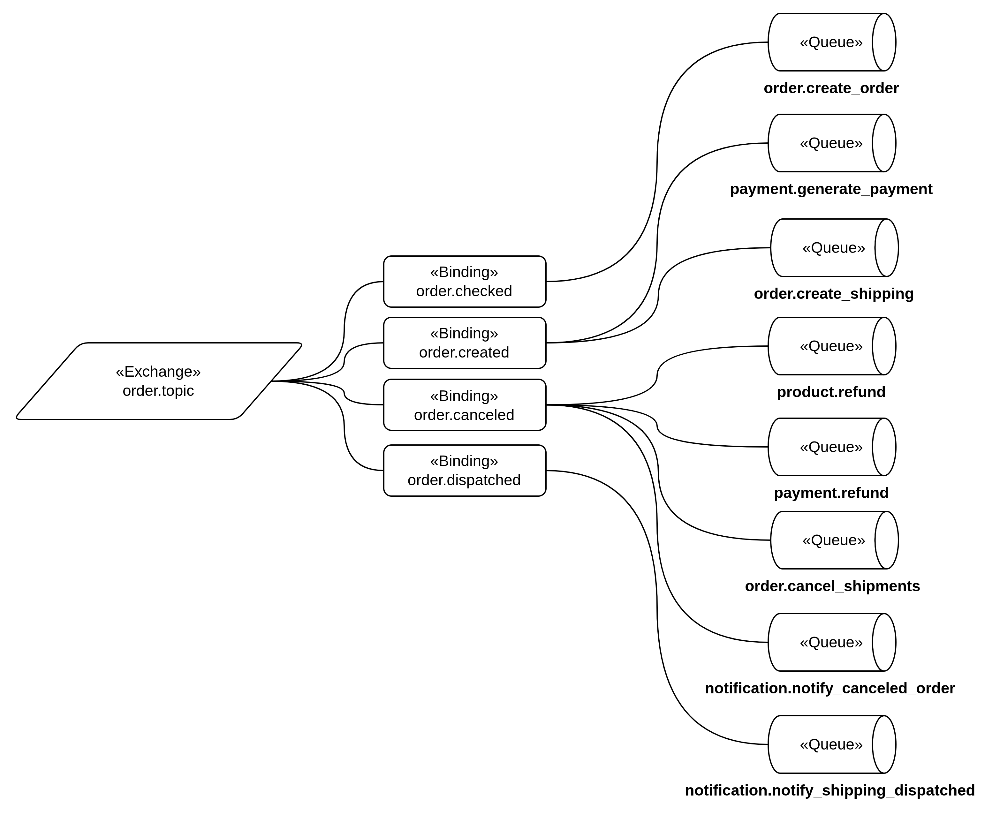
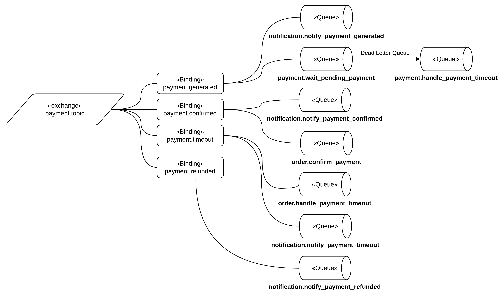
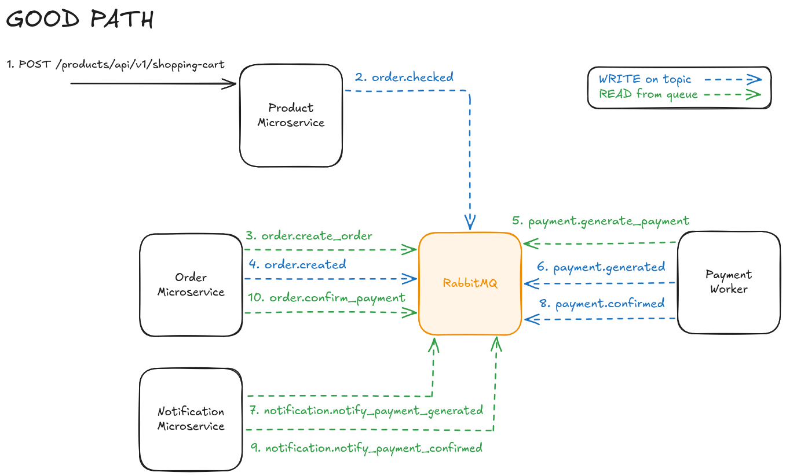

<div align="center">

<br>


<h3> J-Commerce </h3>


<p>  Microservice-based <br>
E-Commerce platform

<br> <br>


</div>


## Microservices

1. [Identity](/microservice-identity/README.md) - Authentication and user profile management.
2. [Product](/microservice-product/README.md) - Product catalogue, stock level and wishlist.
3. [Pricing](/microservice-pricing/README.md) - Pricing engine.
4. [Order](/microservice-order/README.md) - Orders life cycle and shopping cart.
5. [Notification v2](/microservice-notification-v2/README.md) - User notifications management.
6. [Payment Worker](/worker-payment/README.md) - Payment status management (mock).

---

## Index

1. [Stack](#general-stack)
3. [How to execute](#how-to-execute)
3. [Use Cases](#use-cases)
4. [Architecture](#architecture)
5. [Database](#database)
6. [Messaging](#messaging)
7. [License](#License)

---

## General Stack

- Caddy Server
- Java 21
- Kotlin 2.3+
- Spring Boot 4
- Quarkus 3.36
- REST/GraphQL
- Docker
- PostgreSQL + PgVector
- MongoDB
- Redis
- RabbitMQ
- Prometheus
- Grafana

---

## How to execute

### Prerequisites

- Docker
- OpenSSL (for generate RSA key pair)
- Graph Hopper API Key (for geolocation on _Order microservice_)
- OpenAI API Key (for embedding on _Product microservice_)

### Running with Docker Compose

1. **Define environment variables**

   ````bash
   cp .example.env .env
   ```` 
   Update the `.env` file.


2. **Generate RSA Key pair***
    ````bash
    cd microservice-identity/src/main/resources
    ````

    ````bash
    openssl genrsa > app.key
    ````

    ````bash
    openssl rsa -in app.key -pubout -out app.pub
    ````

> [!NOTE]
> You can also use the default key pair for **testing**. 


3. **Start all microservices and infrastructure with docker**:

    ```bash
    docker compose up -d --build
    ```

The HTTPS will be automatically configured with Caddy, and services will be available at:

| Service               | URL                            | Connection       |
|-----------------------|--------------------------------|------------------|
| Identity              | https://localhost/identity     | RESTful API      |
| Product               | https://localhost/product      | GraphQL/HTTP API |
| Pricing               | https://localhost/pricing      | RESTful API      |
| Order                 | https://localhost/order        | RESTful API      |
| Notification          | https://localhost/notification | RESTful API      |
| Grafana               | http://localhost:3000          | Web              |
| Prometheus Panel      | http://localhost:9090          | Web              |
| RabbitMQ Panel        | http://localhost:15672         | Web              |
| Identity Database     | localhost:5432                 | PostgreSQL       |
| Vector Database       | localhost:5433                 | PostgreSQL       |
| Product Database      | localhost:27017                | MongoDB          |
| Pricing Database      | localhost:5434                 | PostgreSQL       |
| Order Database        | localhost:5435                 | PostgreSQL       |
| Notification Database | localhost:5436                 | PostgreSQL       |
| Payment Database      | localhost:5436                 | PostgreSQL       |

The interactive documentation for each microservice will be available at:

| Service      | URL                                         |
|--------------|---------------------------------------------|
| Identity     | http://localhost:8080/swagger-ui/index.html |
| Product      | http://localhost:8081/graphiql              |
| Pricing      | http://localhost:8082/q/swagger-ui          |
| Order        | http://localhost:8083/swagger-ui/index.html |
| Notification | http://localhost:8084/q/swagger-ui          |


> [!NOTE]
> You can also use `docker-compose-mock.yaml` for tests, that contains a mocked catalogue.

---

## VPS-ready application

For VPS environments, you can use the `docker-compose.yaml` file for a VPS-ready application. However, you need to define the _domain_ variable in the `.env` file:

````dotenv
SERVER_DOMAIN=yourdomain.com
````

Services will be available at:

| Service       | URL                      |
|---------------|--------------------------|
| Identity      | https://yourdomain.com/identity    |
| Product       | https://yourdomain.com/product     |
| Pricing       | https://yourdomain.com/pricing     |
| Order         | https://yourdomain.com/order     |
| Notification | https://yourdomain.com/notification     |
| Grafana       | https://grafana.yourdomain.com   |
| Prometheus Panel   | https://prometheus.yourdomain.com   |
| RabbitMQ Panel     | https://rabbitmq.yourdomain.com  |

---

## Use Cases



## Architecture

The system was modeled with concise C4 diagrams.

### System context





###  Containers




## Authentication

Authentication is implemented as a distributed model with one dedicated authorization service and multiple resource servers. The `microservice-identity` is responsible for the full authentication lifecycle. See the full authentication flow [here](microservice-identity/README.md).

## Messaging

The entire order flow is based on asynchronous communication, using **Spring AMQP** and **Quarkus Messaging RabbitMQ** to integrate the **RabbitMQ** Message Broker.

> [!NOTE]
> All queues have a respective Dead Letter Queue named as `<queue-name>.dlq` (they aren't documented here).

### Exchanges

| Name            | Description                             | Routing Keys                                                                    |
|-----------------|-----------------------------------------|---------------------------------------------------------------------------------|
| `product.topic` | Topic exchange to handle product events | `product.sku.created`, `product.sku.deleted`                                    |
| `pricing.topic` | Topic exchange to handle pricing events | `pricing.checked`, `pricing.updated`                                            |
| `order.topic`   | Topic exchange to handle order events   | `order.checked`, `order.created`, `order.canceled`, `order.dispatched`          | 
| `payment.topic` | Topic exchange to handle payment events | `payment.generated`, `payment.confirmed`, `payment.timeout`, `payment.refunded` |
| `dlx.direct`    | Direct exchange for dead letters queues | ...                                                                             |


### Queues

| Name                                      | Description                              |
|-------------------------------------------|------------------------------------------|
| `order.create_order`                      | Create an order from shopping cart       |
| `order.create_shipping`                   | Create shipping for order                |
| `order.handle_payment_timeout`            | Cancel order when payment expires        |
| `order.confirm_payment`                   | Confirm payment of order                 |
| `order.cancel_shipments`                  | Cancel all shipments from order          |
| `payment.generate_payment`                | Generate payment for order               |
| `payment.wait_pending_payment`            | Set TTL of 1 day for payment             |
| `payment.handle_payment_timeout`          | Handle payment timeout after the TTL     |
| `payment.decrease_stock`                  | Decrease stock for outbound products     |
| `payment.refund`                          | Refund all payments from order           |
| `product.refund`                          | Refund all products from order           |
| `product.update_price`                    | Update price of a product                |
| `pricing.register_product`                | Register product mirror                  |
| `pricing.delete_product`                  | Delete product mirror                    |
| `pricing.apply_price`                     | Update checked price                     |
| `notification.notify_payment_generated`   | Notify that a payment has been generated |
| `notification.notify_payment_confirmed`   | Notify that payment has been made        |
| `notification.notify_payment_timeout`     | Notify that payment exceded the TTL      |
| `notification.notify_payment_refunded`    | Notify that payment has been refunded    |
| `notification.notify_shipping_dispatched` | Notify that shipping has been dispatched |
| `notification.notify_canceled_order`      | Notify that order has been canceled      |











### Purchase confirmation

The payment (mock invoice) is generated and notified, through a robust asynchronous messaging flow.



## License

[» MIT License](LICENSE.md)

---

<div align="center">

_Made with ❤️ and ☕ by **Filipe Martins**._

</div>
