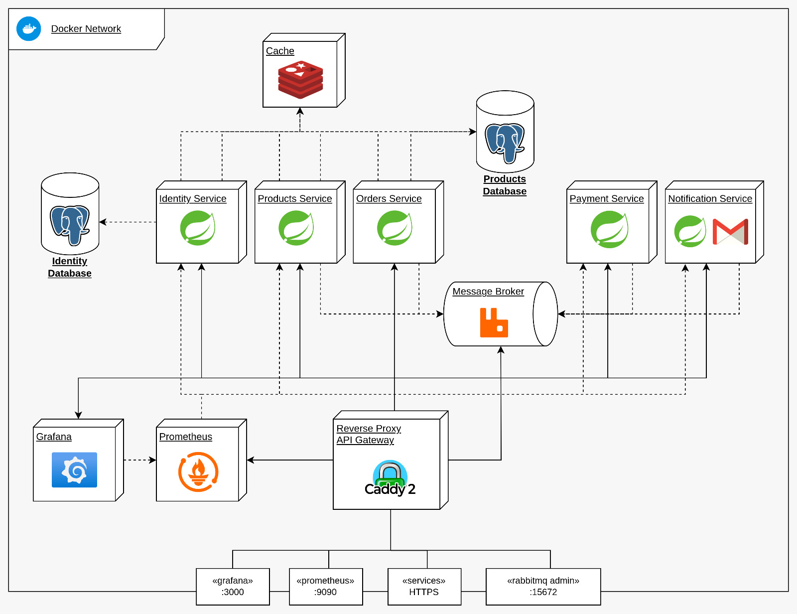

 

<h3> J-Commerce </h3>

  Microservice-based  
E-Commerce platform

> 🚧 Comming soon...

## Microservices

1. [Identity](/microservice-identity/README.md) - Authentication and user profile management.
2. [Products](/microservice-products/README.md) - Product catalogue, stock level and wishlist.
3. [Orders](/microservice-orders/README.md) - Orders life cycle and shopping cart.
4. [Payment](/microservice-payment/README.md) - Payment management. 
5. [Notification](/microservice-notification/README.md) - User notifications management.

---

## Index
1. [Stack](#general-stack)
2. [Architecture](#achitecture)
3. [How to execute](#how-to-execute)
4. [License](#License)

---

## General Stack

- Caddy Server
- Java 21
- Spring Framework
- Docker
- PostgreSQL
- Redis
- RabbitMQ
- Prometheus
- Grafana

---

## Architecture

### Distributed Authentication

- **Authentication Server**: generate and sign JWT. 
- **Resource server**: Just validate the JWT.

- **Asymmetric Cryptograph with ECC Algorithm**
    - Generate ECC Key pair to Authentication Server
    - Resource server have only the Public Key.

#### Validation
This approach invalidates JSON Web Tokens with false signature or modified Payload.

---

## How to execute

> 🚧 In progress...

--- 

## License

[» MIT License](LICENSE.md)

---

_Made with ❤️ and ☕ by **Filipe Martins**._
