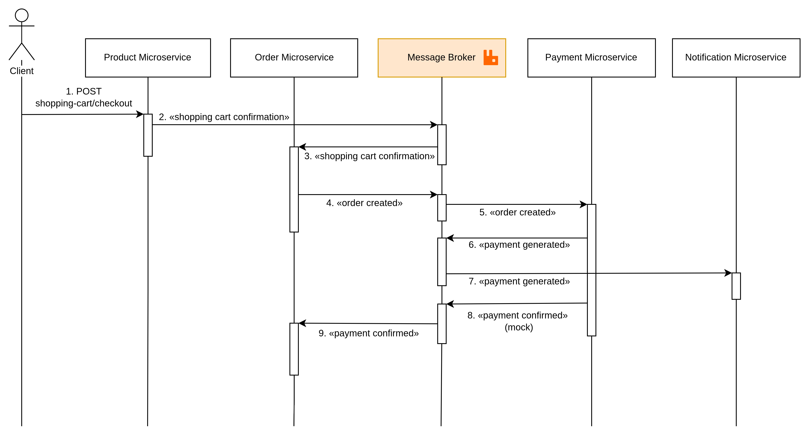

<div align="center">

<br>


<h3> J-Commerce </h3>

<p>  Microservice-based <br>
E-Commerce platform

</div>

>  🚧 In progress...

## Microservices

1. [Identity](/microservice-identity/README.md) - Authentication and user profile management.
2. [Product](/microservice-product/README.md) - Product catalogue, stock level and wishlist.
3. [Order](/microservice-order/README.md) - Orders life cycle and shopping cart.
4. [Payment](/microservice-payment/README.md) - Payment management.
5. [Notification](/microservice-notification/README.md) - User notifications management.

---

## Index

1. [Stack](#general-stack)
2. [Architecture](#achitecture)
3. [How to execute](#how-to-execute)
4. [Default Users](#default-users)
5. [License](#License)

---

## General Stack

- Caddy Server
- Java 21
- Spring Framework
- Docker
- PostgreSQL
- Redis
- RabbitMQ
- Prometheus
- Grafana

---

## How to execute

### Prerequisites

- Docker
- OpenSSL (for generate RSA key pair)

### Running with Docker Compose

1. Generate RSA Key pair*
    ````bash
    cd microservice-identity/src/main/resources
    ````

    ````bash
    openssl genrsa > app.key
    ````

    ````bash
    openssl rsa -in app.key -pubout -out app.pub
    ````
    *You can also use the default key pair for **testing**. 


2. Start all microservices and infrastructure:

    ```bash
    docker compose up -d --build
    ```

Services will be available at:

| Service       | URL                      |
|---------------|--------------------------|
| Identity      | https://localhosts/identity    |
| Product       | https://localhost/product     |
| Order         | https://localhost/order     |
| Payment       | https://localhost/payment     |
| Notification | https://localhost/notification     |
| Grafana       | http://localhost:3000   |
| Prometheus Panel   | http://localhost:9090   |
| RabbitMQ Panel     | http://localhost:15672  |


## Default Users

The Identity microservice creates a default admin user via Flyway migration:

| Email | Password | Role |
|-------|----------|------|
| admin@gmail.com | admin123 | ADMIN |

---

## Architecture


### Authentication

Authentication is implemented as a distributed model with one dedicated authorization service and multiple resource servers.

#### Auth Server

The `microservice-identity` is responsible for the full authentication lifecycle:

- Registers users and stores encrypted passwords with `BCrypt`.
- Authenticates users with email and password.
- Issues signed JWTs for both access and refresh flows.
- Exposes the public key through `/.well-known/jwks.json` so other services can validate tokens without sharing secrets.

JWT signing uses an RSA key pair:

- The private key (`app.key`) stays only in the identity service and is used to sign tokens.
- The public key (`app.pub`) is exposed as JWKS and consumed by the other microservices.
- This keeps token issuance centralized while token validation remains decentralized.

After a successful login, the identity service returns:

- An access token with a short lifetime (`3600` seconds / 1 hour).
- A refresh token with a longer lifetime (`1209600` seconds / 14 days).

The generated JWTs contain the claims used by the platform:

- `sub`: authenticated user id (`UUID`).
- `scope`: user role (`USER`, `ADMIN`, `STOCK_MANAGER`).
- `token_type`: distinguishes `access` from `refresh`.
- `iss`, `iat`, `exp`: issuer and token timestamps.
- `jti`: present on refresh tokens and linked to the persisted refresh token record.

Refresh tokens are also persisted in the identity database. When `/api/v1/auth/refresh` is called, the service validates the JWT signature, checks that `token_type` is `refresh`, revokes the current refresh token, and issues a new access/refresh pair. This makes refresh token rotation explicit and prevents reuse of the same persisted token.

#### Resource Servers

The `product`, `order`, `payment`, `notification`, and protected endpoints inside `identity` itself act as resource servers.

Each service is configured with the JWKS endpoint from `microservice-identity`:

```yaml
spring:
  security:
    oauth2:
      resourceserver:
        jwt:
          jwk-set-uri: http://identity:8080/.well-known/jwks.json
```

With this setup, every resource server validates JWT signatures locally using the public RSA key obtained from the auth service. No shared symmetric secret is required between services.

Authorization is then enforced from the JWT claims:

- Any protected endpoint requires a valid bearer token.
- The authenticated user is identified from `sub`.
- Role-based access is derived from `scope`, which Spring Security maps to authorities such as `SCOPE_ADMIN`.
- Admin routes such as `/admin/**` require elevated scope, while user-specific routes read the authenticated user id directly from the validated JWT.

In practice, the flow is:

1. The client authenticates against `microservice-identity`.
2. The identity service signs and returns JWTs using its RSA private key.
3. The client sends the access token to other microservices as a bearer token.
4. Each microservice fetches the public key from the JWKS endpoint and validates the token locally.
5. The service authorizes the request based on `sub` and `scope`, without calling the auth service for every request.

## Purchase confirmation

The payment (mock invoice) is generated and sent by email.



## License

[» MIT License](LICENSE.md)

---

_Made with ❤️ and ☕ by **Filipe Martins**._
