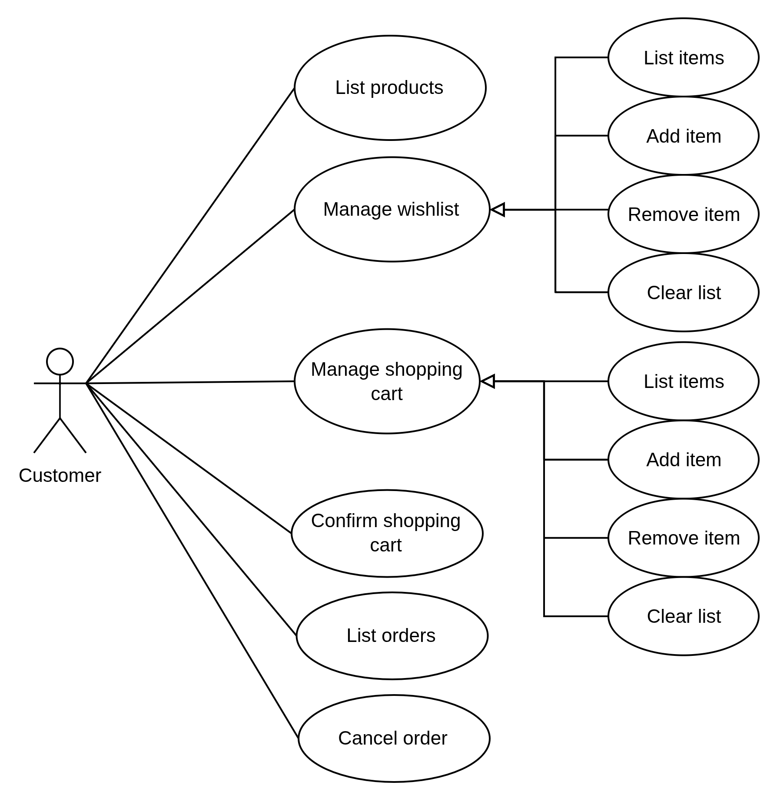
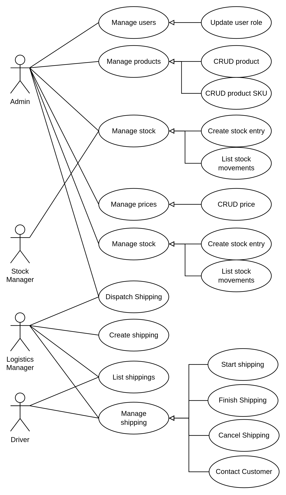
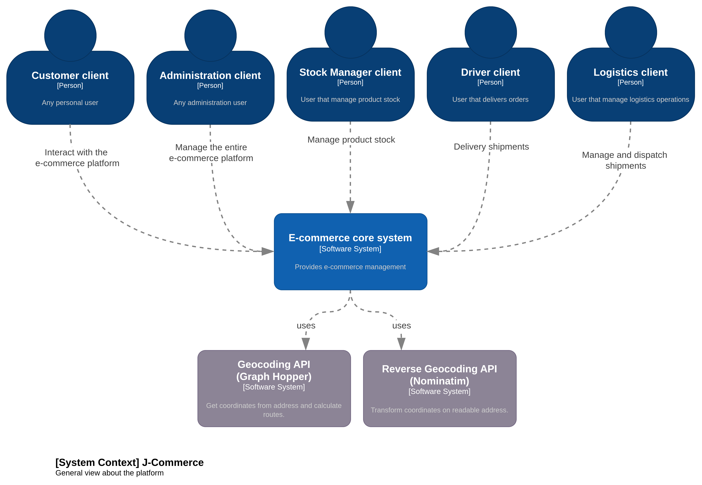
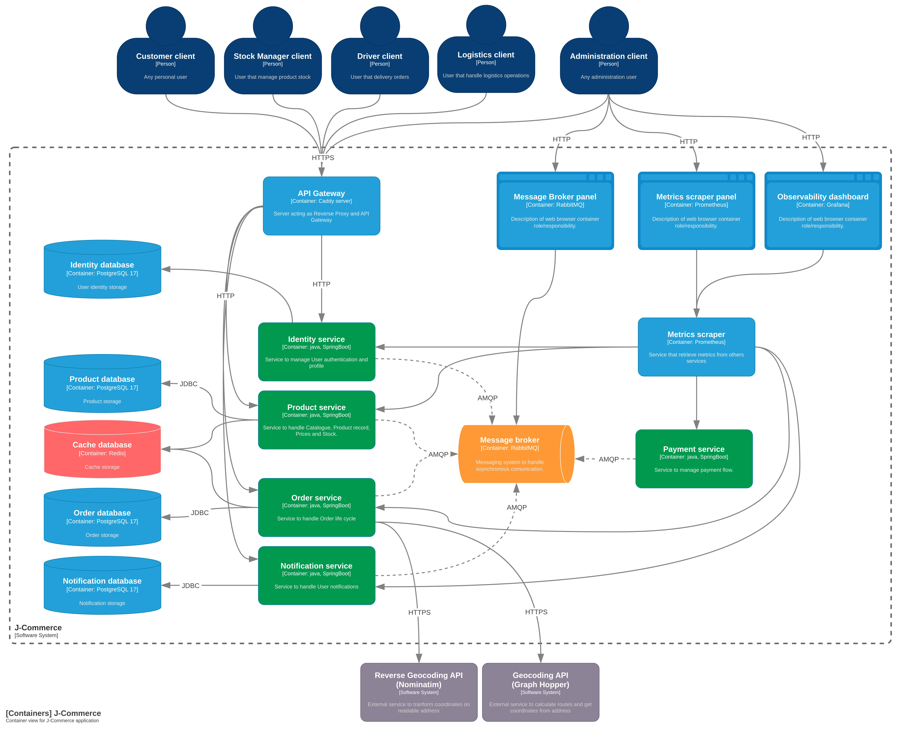
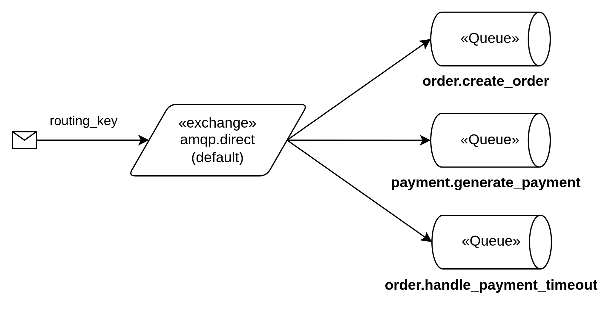
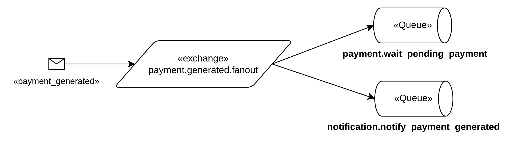
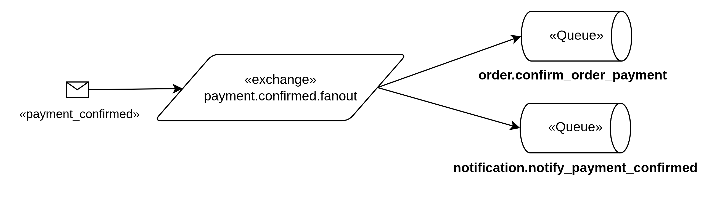
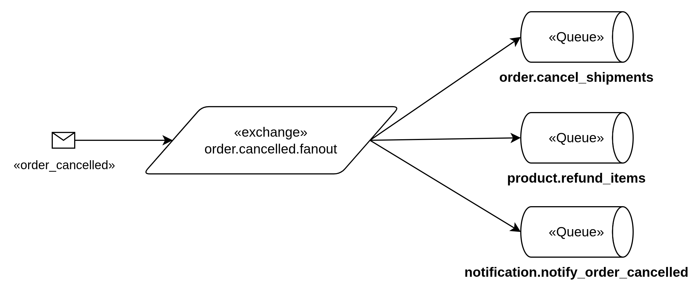
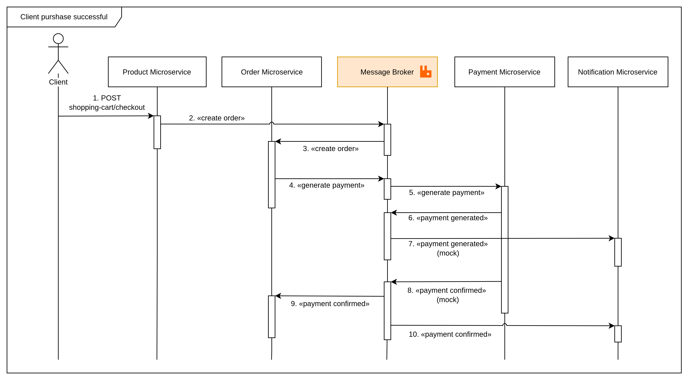

<div align="center">

<br>


<h3> J-Commerce </h3>


<p>  Microservice-based <br>
E-Commerce platform


</div>


## Microservices

1. [Identity](/microservice-identity/README.md) - Authentication and user profile management.
2. [Product](/microservice-product/README.md) - Product catalogue, stock level and wishlist.
3. [Order](/microservice-order/README.md) - Orders life cycle and shopping cart.
4. [Payment](/microservice-payment/README.md) - Payment management.
5. [Notification (Deprecated)](/microservice-notification/README.md) - User notifications management.
6. [Notification v2](/microservice-notification-v2/README.md) - User notifications management.

---

## Index

1. [Stack](#general-stack)
3. [How to execute](#how-to-execute)
3. [Use Cases](#use-cases)
4. [Architecture](#architecture)
5. [Database](#database)
6. [Messaging](#messaging)
7. [License](#License)

---

## Count Lines Of Code

````text
-------------------------------------------------------------------------------
Language                     files          blank        comment           code
-------------------------------------------------------------------------------
Java                           355           3887            243          18381
XML                             51             45              0           4241
Markdown                        15            643              0           2016
YAML                            97            285             39           1916
Maven                            5             41              5            975
SQL                             13            113              9            816
Bourne Shell                     2             36             52            221
DOS Batch                        1             24              0            165
Text                            37              0              0            148
INI                              4              0              0             23
Dockerfile                       2              6              0             15
Properties                       2              0              0              6
-------------------------------------------------------------------------------
SUM:                           584           5080            348          28923
-------------------------------------------------------------------------------
````

## General Stack

- Caddy Server
- Java 21
- Spring Boot
- Quarkus
- Docker
- PostgreSQL + PgVector
- Redis
- RabbitMQ
- Prometheus
- Grafana

---

## How to execute

### Prerequisites

- Docker
- OpenSSL (for generate RSA key pair)
- Graph Hopper API Key (for geolocation on _Order microservice_)
- OpenAI API Key (for embedding on _Product microservice_)

### Running with Docker Compose

1. **Define environment variables**

   ````bash
   cp .example.env .env
   ````
   
   Update the `.env` file.


2. **Generate RSA Key pair***
    ````bash
    cd microservice-identity/src/main/resources
    ````

    ````bash
    openssl genrsa > app.key
    ````

    ````bash
    openssl rsa -in app.key -pubout -out app.pub
    ````
    *You can also use the default key pair for **testing**. 


3. **Start all microservices and infrastructure with docker**:

    ```bash
    docker compose -f docker-compose.yaml up -d --build
    ```

The HTTPS will be automatically configured with Caddy, and services will be available at:

| Service               | URL                            |
|-----------------------|--------------------------------|
| Identity              | https://localhost/identity     |
| Product               | https://localhost/product      |
| Order                 | https://localhost/order        |
| Payment               | https://localhost/payment      |
| Notification          | https://localhost/notification |
| Grafana               | http://localhost:3000          |
| Prometheus Panel      | http://localhost:9090          |
| RabbitMQ Panel        | http://localhost:15672         |
| Identity Database     | localhost:5432                 |
| Product Database      | localhost:5433                 |
| Order Database        | localhost:5434                 |
| Notification Database | localhost:5435                 |

The Swagger UI for each microservice will be available at:

| Service       | URL                                         |
|---------------|---------------------------------------------|
| Identity      | http://localhost:8080/swagger-ui/index.html |
| Product       | http://localhost:8081/swagger-ui/index.html |
| Order         | http://localhost:8082/swagger-ui/index.html |
| Notification  | http://localhost:8083/q/swagger-ui          |

## Default Users

The Identity microservice creates default users via Flyway migration:

| Email               | Password     | Roles                   |
|---------------------|--------------|-------------------------|
| admin@gmail.com     | admin123     | `USER`, `ADMIN`         |
| common@gmail.com    | common123    | `USER`                  |
| stockman@gmail.com  | stockman123  | `USER`, `STOCK_MANAGER` |
| driver@gmail.com    | driver123    | `USER`, `DRIVER`        |
| logistics@gmail.com | logistics123 | `USER`, `LOGISTICS`     |

---

## VPS-ready application

You can also use the `docker-compose.yaml` file for a VPS-ready application. However, you need to define the _domain_ variable in the `.env` file:

````dotenv
SERVER_DOMAIN=yourdomain.com
````

Services will be available at:

| Service       | URL                      |
|---------------|--------------------------|
| Identity      | https://yourdomain.com/identity    |
| Product       | https://yourdomain.com/product     |
| Order         | https://yourdomain.com/order     |
| Payment       | https://yourdomain.com/payment     |
| Notification | https://yourdomain.com/notification     |
| Grafana       | https://grafana.yourdomain.com   |
| Prometheus Panel   | https://prometheus.yourdomain.com   |
| RabbitMQ Panel     | https://rabbitmq.yourdomain.com  |

---

## Use Cases

### Customer use cases



### Management use cases




## Architecture

The system has a concise list of C4 Model diagrams for architecture documentation. 

### System context




###  Containers




### Authentication

Authentication is implemented as a distributed model with one dedicated authorization service and multiple resource servers.

#### Auth Server

The `microservice-identity` is responsible for the full authentication lifecycle:

- Registers users and stores encrypted passwords with `BCrypt`.
- Authenticates users with email and password.
- Issues signed JWTs for both access and refresh flows.
- Exposes the public key through `/.well-known/jwks.json` so other services can validate tokens without sharing secrets.

JWT signing uses an RSA key pair:

- The private key (`app.key`) stays only in the identity service and is used to sign tokens.
- The public key (`app.pub`) is exposed as JWKS and consumed by the other microservices.
- This keeps token issuance centralized while token validation remains decentralized.

After a successful login, the identity service returns:

- An access token with a short lifetime (`3600` seconds / 1 hour).
- A refresh token with a longer lifetime (`1209600` seconds / 14 days).

The generated JWTs contain the claims used by the platform:

- `sub`: authenticated user id (`UUID`).
- `scope`: user role (`USER`, `ADMIN`, `STOCK_MANAGER`).
- `token_type`: distinguishes `access` from `refresh`.
- `iss`, `iat`, `exp`: issuer and token timestamps.
- `jti`: present on refresh tokens and linked to the persisted refresh token record.

Refresh tokens are also persisted in the identity database. When `/api/v1/auth/refresh` is called, the service validates the JWT signature, checks that `token_type` is `refresh`, revokes the current refresh token, and issues a new access/refresh pair. This makes refresh token rotation explicit and prevents reuse of the same persisted token.

#### Resource Servers

The `product`, `order`, `payment`, `notification`, and protected endpoints inside `identity` itself act as resource servers.

Each service is configured with the JWKS endpoint from `microservice-identity`:

```yaml
spring:
  security:
    oauth2:
      resourceserver:
        jwt:
          jwk-set-uri: http://identity:8080/.well-known/jwks.json
```


With this setup, every resource server validates JWT signatures locally using the public RSA key obtained from the auth service. No shared symmetric secret is required between services.

Authorization is then enforced from the JWT claims:

- Any protected endpoint requires a valid bearer token.
- The authenticated user is identified from `sub`.
- Role-based access is derived from `scope`, which Spring Security maps to authorities such as `SCOPE_ADMIN`.
- Admin routes such as `/admin/**` require elevated scope, while user-specific routes read the authenticated user id directly from the validated JWT.

In practice, the flow is:

1. The client authenticates against `microservice-identity`.
2. The identity service signs and returns JWTs using its RSA private key.
3. The client sends the access token to other microservices as a bearer token.
4. Each microservice fetches the public key from the JWKS endpoint and validates the token locally.
5. The service authorizes the request based on `sub` and `scope`, without calling the auth service for every request.

## Database

The entire project is following the principle of **Soft Delete**. No data is deleted, only marked as _inactive_. This approach exists to: 

- Create an **auditable** application.
- Reduce the processing of **batch and cascading deletes** in the database.

## Messaging

The entire order flow is based on asynchronous communication, using **Spring AMQP** to integrate the **RabbitMQ** Message Broker.

### Exchanges

| Name                       | Description                                                 | Destin Queues                                                                                             |
|----------------------------|-------------------------------------------------------------|-----------------------------------------------------------------------------------------------------------|
| `amqp.direct`              | Default exchange to set direct queues                       | `order.create_order`, `order.create_shipping`, `payment.generate_payment`, `order.handle_payment_timeout` |
| `payment.generated.fanout` | Fanout exchange to notify that a payment has been generated | `payment.wait_pending_payment`, `notification_notify_payment_generated`                                   | 
| `payment.confirmed.fanout` | Fanout exchange to notify that a payment has been confirmed | `order.confirm_order_payment`, `notification.notify_payment_confirmed`                                    |
| `order.cancelled.fanout`   | Fanout exchange to cancel an order                          | `order.cancel_shipments`, `product.refund_items`, `notification.notify_order_cancelled`                   |


### Queues

| Name                                    | Description                                       |
|-----------------------------------------|---------------------------------------------------|
| `order.create_order`                    | Create an order from shopping cart                |
| `order.handle_payment_timeout`          | Cancel order when payment expires                 |
| `order.confirm_order_payment`           | Confirm payment of order                          |
| `payment.generate_payment`              | Generate payment for order                        |
| `payment.wait_pending_payment`          | Set TTL of 1 day for payment                      |
| `notification.notify_payment_generated` | Notify the user that a payment has been generated |
| `notification.notify_payment_confirmed` | Notify the user that payment has been made        |
| `order.create_shipping`                 | Create shipping for order                         |
| `order.cancel_shipments`                | Cancel shipments from order                       |











### Purchase confirmation

The payment (mock invoice) is generated and notified, through a robust asynchronous messaging flow.



## License

[» MIT License](LICENSE.md)

---

<div align="center">

_Made with ❤️ and ☕ by **Filipe Martins**._

</div>
