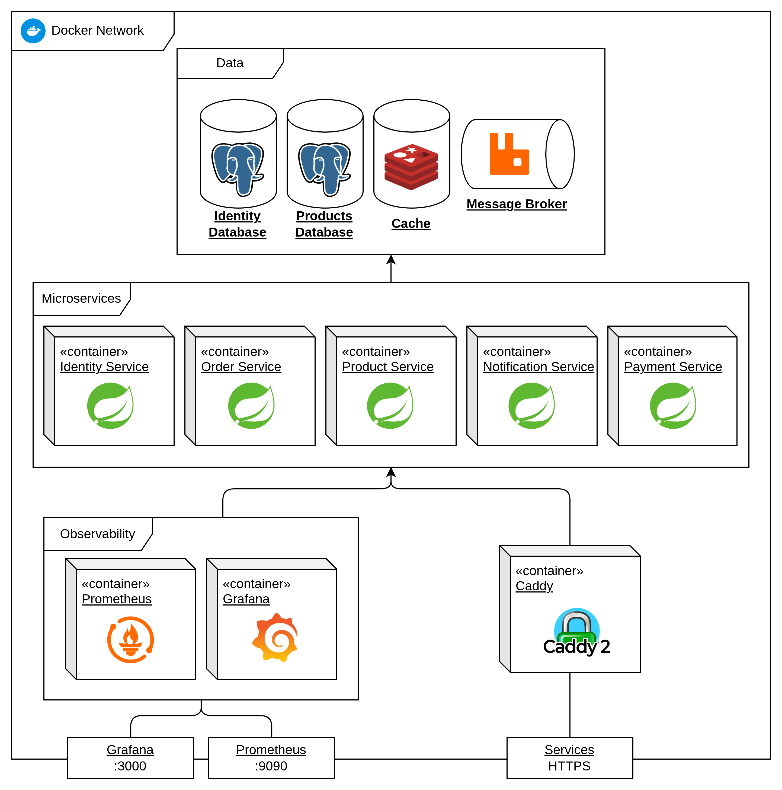
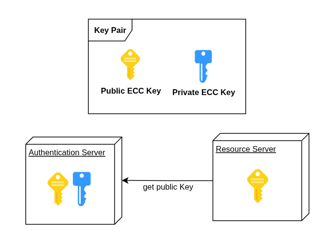
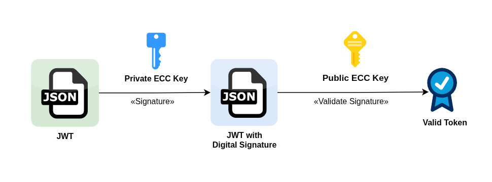
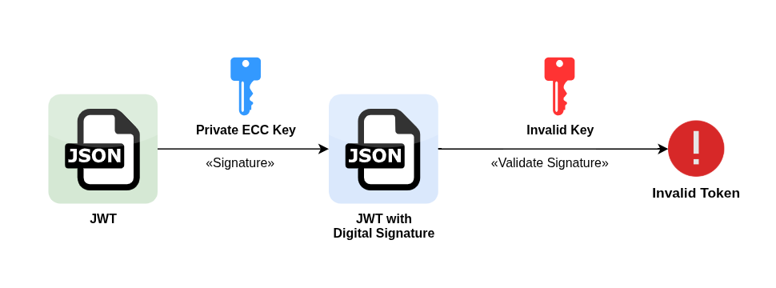
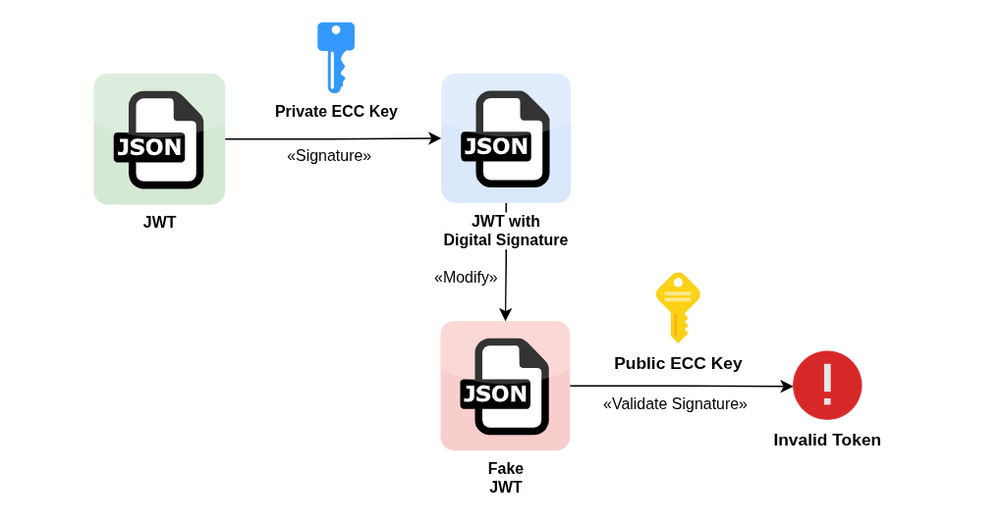

<div align="center">

<br>


<h3> J-Commerce </h3>

<p>  Microservice-based <br>
E-Commerce platform

</div>

## Microservices

1. [Identity](/microservice-identity/README.md) - Authentication and user profile management.
2. [Product](/microservice-product/README.md) - Product catalogue, stock level and wishlist.
3. [Order](/microservice-order/README.md) - Orders life cycle and shopping cart.
4. [Payment](/microservice-payment/README.md) - Payment management.
5. [Notification](/microservice-notification/README.md) - User notifications management.

---

## Index

1. [Stack](#general-stack)
2. [Architecture](#achitecture)
3. [How to execute](#how-to-execute)
4. [Default Users](#default-users)
5. [License](#License)

---

## General Stack

- Caddy Server
- Java 21
- Spring Framework
- Docker
- PostgreSQL
- Redis
- RabbitMQ
- Prometheus
- Grafana

---

## How to execute

### Prerequisites

- Docker

### Running with Docker Compose

Start all microservices and infrastructure:

```bash
docker compose up --build
```

Services will be available at:

| Service       | URL                      |
|---------------|--------------------------|
| Identity      | https://localhosts/identity    |
| Product       | https://localhost/product     |
| Order         | https://localhost/order     |
| Payment       | https://localhost/payment     |
| Notification | https://localhost/notification     |
| Grafana       | http://localhost:3000   |
| Prometheus   | http://localhost:9090   |
| RabbitMQ     | http://localhost:15672  |


## Default Users

The Identity microservice creates a default admin user via Flyway migration:

| Email | Password | Role |
|-------|----------|------|
| admin@gmail.com | admin123 | ADMIN |

---


## Architecture



### Authentication

- **Authentication Server**: generate and sign JWT.
- **Resource server**: Just validate the JWT.

- **Asymmetric Cryptograph with RSA or ECC Algorithm**
    - Generate RSA or ECC Key pair to Authentication Server
    - Resource server have only the Public Key.




#### Validation
This approach invalidates JSON Web Tokens with false signature or modified Payload.







---

## License

[» MIT License](LICENSE.md)

---

_Made with ❤️ and ☕ by **Filipe Martins**._
