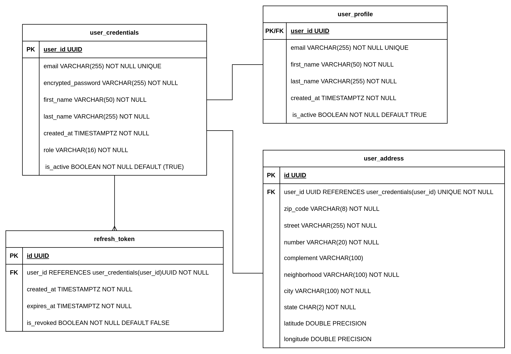

[« Home](../README.md)

# Identity Microservice

Microservice for authentication, user management and profile handling.

## Features

### Authentication

- User registration
- Login with email/password
- JWT token generation (access + refresh)
- Token refresh
- JWKS endpoint for public key discovery

### User Management

- User profile management
- Role-based access control (`USER`, `ADMIN`, `STOCK_MANAGER`, `DRIVER` and `LOGISTICS`)
- User listing
- User role update

### Profile

- User profile creation (auto on registration)
- Profile updates

## API Endpoints

### Application

| Method | Endpoint | Description | Query Parameters |
|--------|----------|-------------|----------------|
| GET | /actuator/health | Get application health | - |
| GET | /swagger-ui/index.html | Swagger UI | - |

### Authentication

| Method | Endpoint | Description | Query Parameters |
|--------|----------|-------------|----------------|
| POST | /api/v1/auth/register | Register new user | - |
| POST | /api/v1/auth/login | Login | - |
| POST | /api/v1/auth/refresh | Refresh tokens | - |

### User Profile

| Method | Endpoint | Description | Query Parameters |
|--------|----------|-------------|----------------|
| GET | /api/v1/users/me | Get current user profile | - |

### Admin

| Method | Endpoint | Description | Query Parameters |
|--------|----------|-------------|----------------|
| GET | /admin/api/v1/users | List users | `page`, `size`, `sort` |
| GET | /admin/api/v1/users/{userId} | Get user by ID | - |
| PATCH | /admin/api/v1/users/{userId} | Update user role | - |

### Well-Known

| Method | Endpoint | Description | Query Parameters |
|--------|----------|-------------|----------------|
| GET | /.well-known/jwks.json | Get public JWKS | - |

## Default Users

On first run, default users are created via Flyway migration:

| Email | Password     | Roles                   |
|-------|--------------|-------------------------|
| admin@gmail.com | admin123     | `USER`, `ADMIN`         |
| common@gmail.com | common123    | `USER`                  |
| stockman@gmail.com | stockman123  | `USER`, `STOCK_MANAGER` |
| driver@gmail.com | driver123    | `USER`, `DRIVER`        |
| logistics@gmail.com | logistics123 | `USER`, `LOGISTICS`     |

## Database

- PostgreSQL 17
- Flyway for migrations

