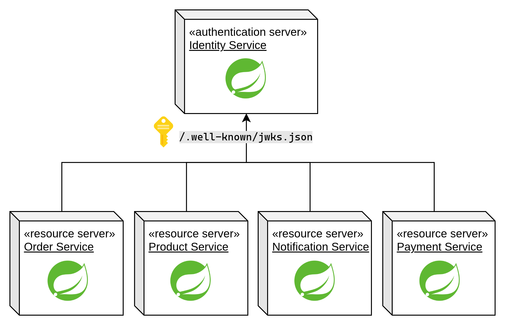
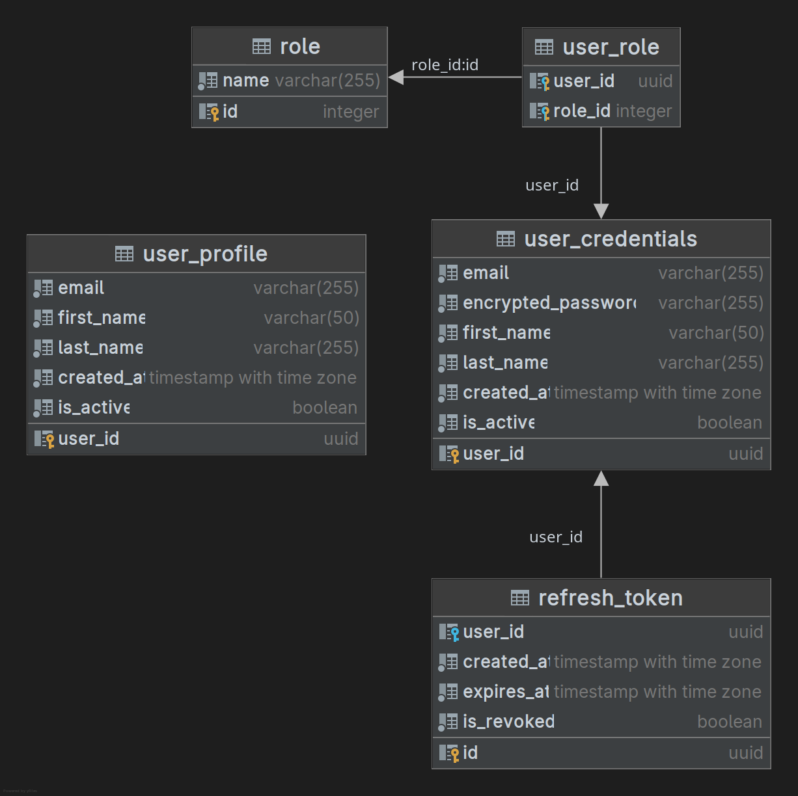

[« Home](../README.md)

# Identity Microservice

Microservice for authentication, user management and profile handling.

## Stack
- Java 21
- Spring Boot 4.x
- Spring Security
- OpenAPI (Swagger)
- PostgreSQL 17

## Features

### Authentication

- User registration
- Login with email/password
- JWT token generation (access + refresh)
- Token refresh
- JWKS endpoint for public key discovery

## User Management

The Identity microservice creates default users via Flyway migration:

| Email               | Password     | Roles                   |
|---------------------|--------------|-------------------------|
| common@gmail.com    | common123    | `USER`                  |
| admin@gmail.com     | admin123     | `USER`, `ADMIN`         |
| stockman@gmail.com  | stockman123  | `USER`, `STOCK_MANAGER` |
| driver@gmail.com    | driver123    | `USER`, `DRIVER`        |
| logistics@gmail.com | logistics123 | `USER`, `LOGISTICS`     |


## API Endpoints

### Application

| Method | Endpoint | Description | Query Parameters |
|--------|----------|-------------|----------------|
| GET | /actuator/health | Get application health | - |
| GET | /swagger-ui/index.html | Swagger UI | - |

### Authentication

| Method | Endpoint | Description | Query Parameters |
|--------|----------|-------------|----------------|
| POST | /api/v1/auth/register | Register new user | - |
| POST | /api/v1/auth/login | Login | - |
| POST | /api/v1/auth/refresh | Refresh tokens | - |

### User Profile

| Method | Endpoint | Description | Query Parameters |
|--------|----------|-------------|----------------|
| GET | /api/v1/users/me | Get current user profile | - |

### Admin

| Method | Endpoint | Description | Query Parameters |
|--------|----------|-------------|----------------|
| GET | /admin/api/v1/users | List users | `page`, `size`, `sort` |
| GET | /admin/api/v1/users/{userId} | Get user by ID | - |
| PATCH | /admin/api/v1/users/{userId} | Update user role | - |

### Well-Known

| Method | Endpoint | Description | Query Parameters |
|--------|----------|-------------|----------------|
| GET | /.well-known/jwks.json | Get public JWKS | - |

## Default Users

On first run, default users are created via Flyway migration:

| Email | Password     | Roles                   |
|-------|--------------|-------------------------|
| admin@gmail.com | admin123     | `USER`, `ADMIN`         |
| common@gmail.com | common123    | `USER`                  |
| stockman@gmail.com | stockman123  | `USER`, `STOCK_MANAGER` |
| driver@gmail.com | driver123    | `USER`, `DRIVER`        |
| logistics@gmail.com | logistics123 | `USER`, `LOGISTICS`     |


## Authentication Architecture

The identity is provided by a local auth-server and distributed consumers, using Spring Security. The authentication flow includes:

- Registers users and stores encrypted passwords with `BCrypt`.
- Authenticates users with email and password.
- Issues signed JWTs for both access and refresh flows.
- Exposes the public key through `/.well-known/jwks.json` so other services can validate tokens without sharing secrets.

JWT signing uses an RSA key pair:

- The private key (`app.key`) stays only in the identity service and is used to sign tokens.
- The public key (`app.pub`) is exposed as JWKS and consumed by the other microservices.
- This keeps token issuance centralized while token validation remains decentralized.

After a successful login, the identity service returns:

- An access token with a short lifetime (`3600` seconds / 1 hour).
- A refresh token with a longer lifetime (`1209600` seconds / 14 days).

The generated JWTs contain the claims used by the platform:

- `sub`: authenticated user id (`UUID`).
- `scope`: user role (`USER`, `ADMIN`, `STOCK_MANAGER`).
- `token_type`: distinguishes `access` from `refresh`.
- `iss`, `iat`, `exp`: issuer and token timestamps.
- `jti`: present on refresh tokens and linked to the persisted refresh token record.

Refresh tokens are also persisted in the identity database. When `/api/v1/auth/refresh` is called, the service validates the JWT signature, checks that `token_type` is `refresh`, revokes the current refresh token, and issues a new access/refresh pair. This makes refresh token rotation explicit and prevents reuse of the same persisted token.

#### Resource Servers

The `product`, `order`, `payment`, `notification`, and protected endpoints inside `identity` itself act as resource servers.

Each service is configured with the JWKS endpoint from `microservice-identity`:

```yaml
spring:
  security:
    oauth2:
      resourceserver:
        jwt:
          jwk-set-uri: http://identity:8080/.well-known/jwks.json
```



With this setup, every resource server validates JWT signatures locally using the public RSA key obtained from the auth service. No shared symmetric secret is required between services.

Authorization is then enforced from the JWT claims:

- Any protected endpoint requires a valid bearer token.
- The authenticated user is identified from `sub`.
- Role-based access is derived from `scope`, which Spring Security maps to authorities such as `SCOPE_ADMIN`.
- Admin routes such as `/admin/**` require elevated scope, while user-specific routes read the authenticated user id directly from the validated JWT.

In practice, the flow is:

1. The client authenticates against `microservice-identity`.
2. The identity service signs and returns JWTs using its RSA private key.
3. The client sends the access token to other microservices as a bearer token.
4. Each microservice fetches the public key from the JWKS endpoint and validates the token locally.
5. The service authorizes the request based on `sub` and `scope`, without calling the auth service for every request.


## Database

The entire service is following the principle of **Soft Delete**. No data is deleted, only marked as _inactive_. This approach exists to:

- Create an **auditable** application.
- Reduce the processing of **batch and cascading deletes** in the database.

### Stack

- PostgreSQL 17
- Flyway for migrations


### Entity Relationship Diagram


