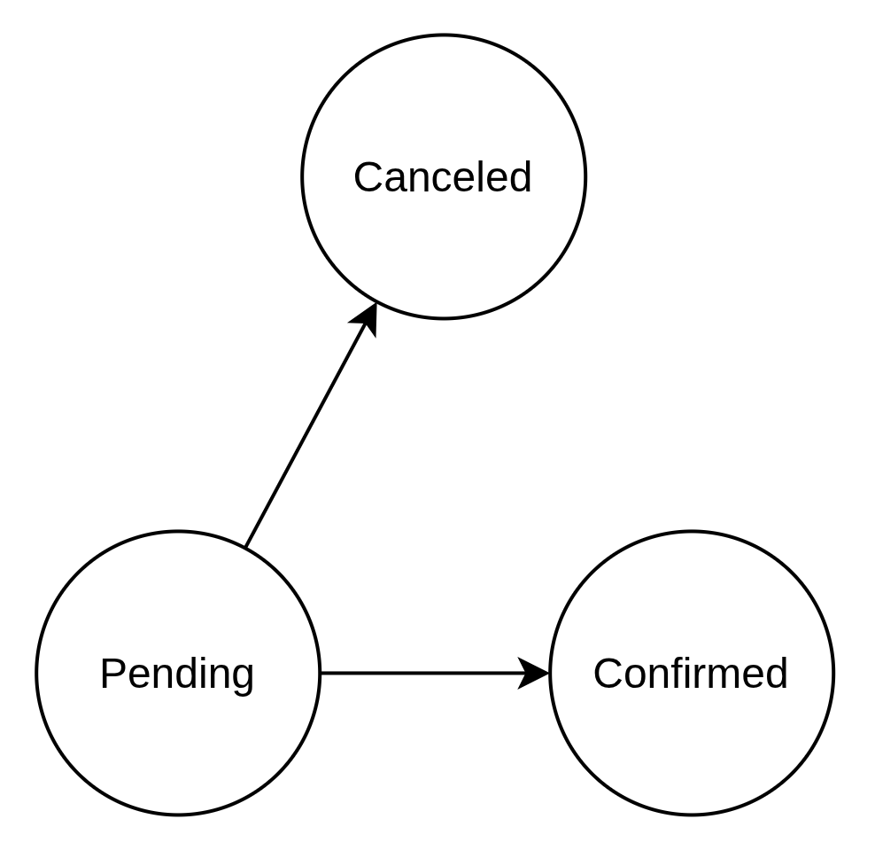
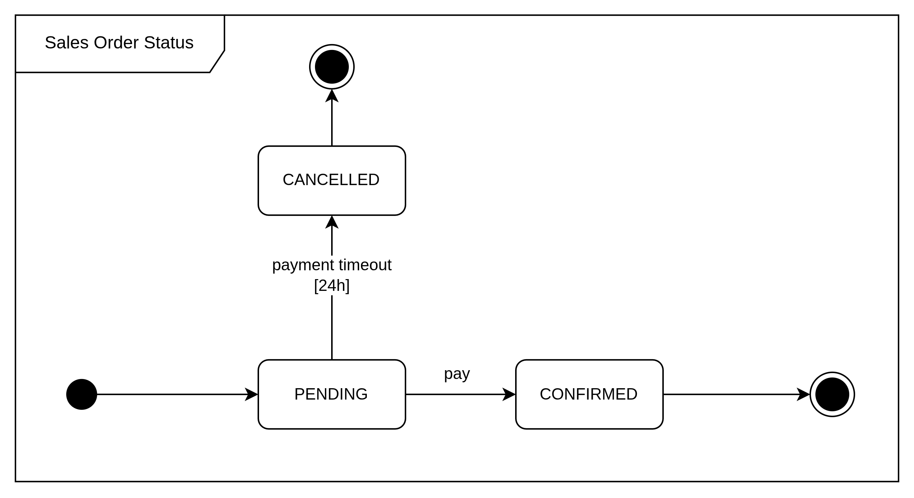
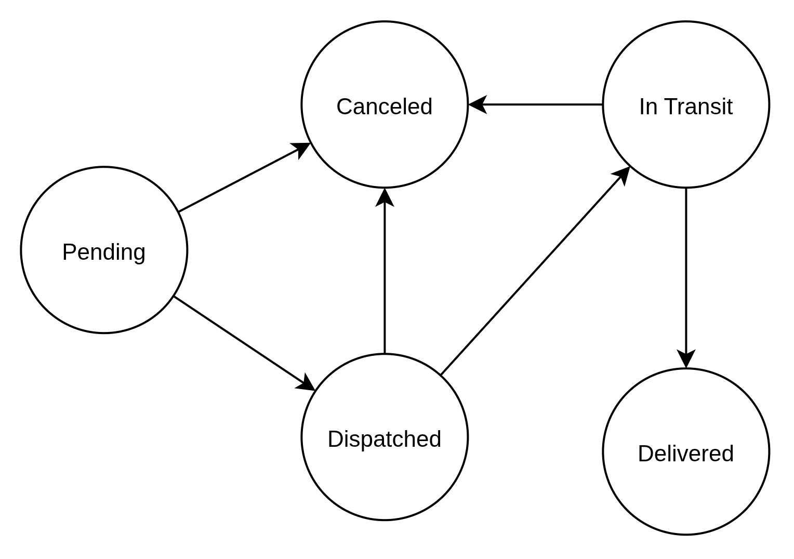
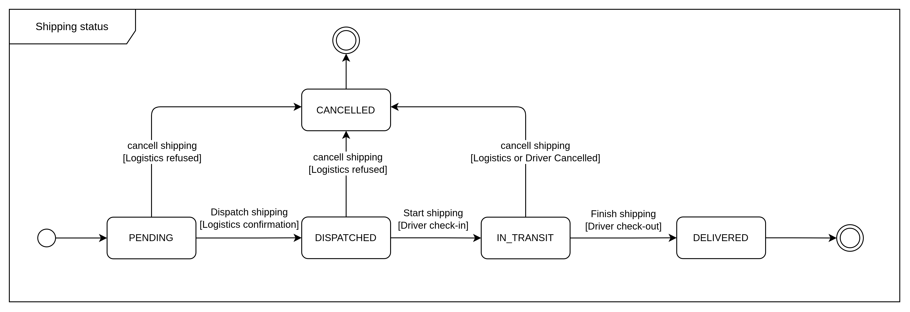

[« Home](../README.md)

# Order Microservice

Microservice to handle order flow and shipping logistics operations.

## Stack

- Java 21
- Spring Boot 4.x
- OpenAPI(Swagger)
- PostgreSQL 17 

## API Endpoints

### Application

| Method | Endpoint | Description | Query Parameters |
|--------|----------|-------------|----------------|
| GET | /actuator/health | Get application health | - |
| GET | /swagger-ui/index.html | Swagger UI | - |

### Sales Orders

| Method | Endpoint | Description | Query Parameters |
|--------|----------|-------------|----------------|
| GET | /api/v1/sales-orders | List user's orders | `page`, `size`, `sort` |
| GET | /api/v1/sales-orders/{orderId} | Get order by ID | - |
| DELETE | /api/v1/sales-orders/{orderId} | Request order cancellation | - |

### Delivery Addresses

| Method | Endpoint | Description | Query Parameters |
|--------|----------|-------------|----------------|
| GET | /api/v1/delivery-addresses | List user's addresses | `page`, `size`, `sort` |
| GET | /api/v1/delivery-addresses/{id} | Get address by ID | - |
| POST | /api/v1/delivery-addresses | Create address | `byCoordinates`|
| PATCH | /api/v1/delivery-addresses/{id} | Update address | - |
| DELETE | /api/v1/delivery-addresses/{id} | Delete address | - |

### Admin - Storage Addresses

| Method | Endpoint | Description | Query Parameters       |
|--------|----------|-------------|------------------------|
| GET | /admin/api/v1/storage-addresses | List storage addresses | `page`, `size`, `sort` |
| GET | /admin/api/v1/storage-addresses/{id} | Get storage address by ID | -                      |
| POST | /admin/api/v1/storage-addresses | Create storage address | `byCoordinates`        |
| DELETE | /admin/api/v1/storage-addresses/{id} | Delete storage address | -                      |

### Admin - Shippings

| Method | Endpoint | Description | Query Parameters |
|--------|----------|-------------|----------------|
| GET | /admin/api/v1/shippings | List all shippings | `salesOrderId`, `page`, `size`, `sort` |
| POST | /admin/api/v1/shippings/{id} | Dispatch shipping | - |
| POST | /admin/api/v1/shippings/{id}/check-in | Start shipping (check-in) | - |
| POST | /admin/api/v1/shippings/{id}/check-out | Finish shipping (check-out) | - |
| DELETE | /admin/api/v1/shippings/{id} | Cancel shipping | - |

## Order Status

Either order and shipping status can be modeled with the State-Machine Pattern, as seen below.

## Shopping cart confirmation

## Database

### Stack

- PostgreSQL 17
- Flyway for migrations

### Entity Relationship Diagram

