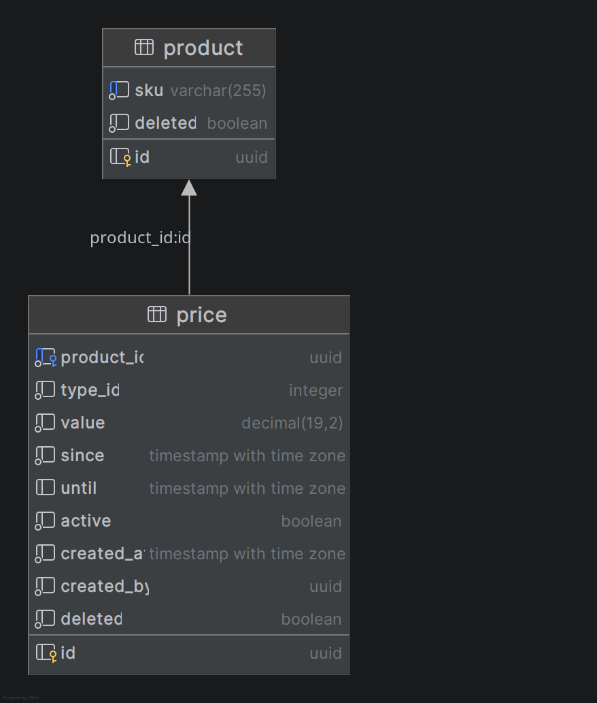

[« Home](../README.md)

# Pricing Microservice

Engine for scheduled prices, built with Clean Architecture. 

## Stack

- Kotlin 2.4
- Quarkus 3.38
- OpenAPI (Swagger)
- PostgreSQL 17

## Database

### Stack

- PostgreSQL 17
- Flyway for migrations

### Entity Relationship Diagram
