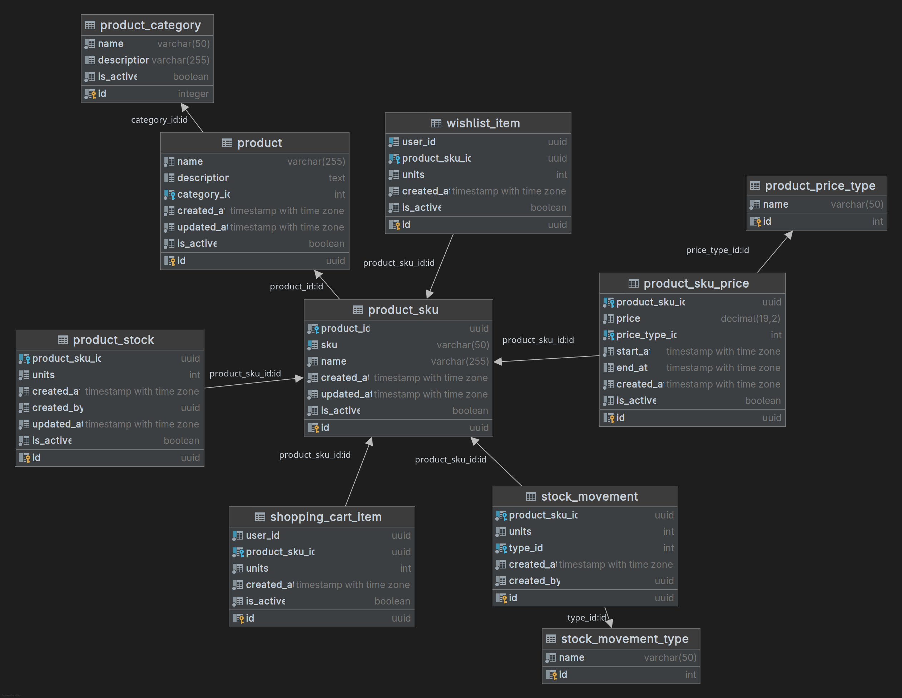
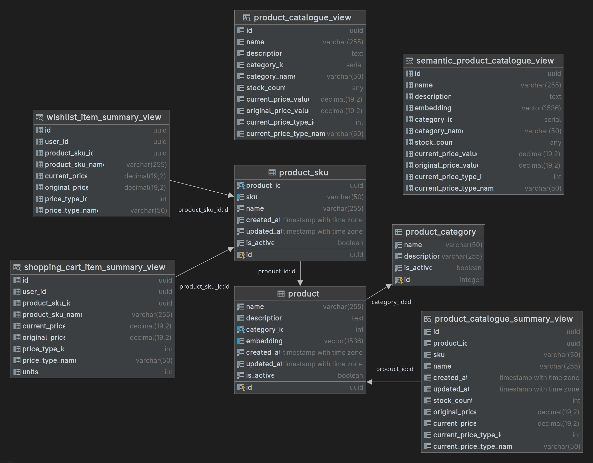

[« Home](../README.md)

# Product Microservice

Microservice for managing product catalogue, stock, pricing, shopping cart, wishlist and product feedback.

## Features

### Catalogue

- Product management (CRUD)
- Product SKU management
- Category management
- Product search and filtering

### Pricing

- Multiple price types per SKU
- Price history with start/end dates
- Active price lookup

### Stock

- Stock level tracking per SKU
- Stock movement history
- Stock adjustment (input/output)

### Wishlist

- Per-user wishlist
- Add/remove favorite products

### Shopping Cart

- Per-user cart
- Add/remove items

## API Endpoints

### Application

| Method | Endpoint | Description | Query Parameters |
|--------|----------|-------------|----------------|
| GET | /actuator/health | Get application health | - |
| GET | /swagger-ui/index.html | Swagger UI | - |

### Public Catalogue

| Method | Endpoint | Description | Query Parameters |
|--------|----------|------------|----------------|
| GET | /api/v1/categories | List product categories | `page`, `size`, `sort` |
| GET | /api/v1/products | List products | `categoryId`, `query` `page`, `size`, `sort` |
| GET | /api/v1/products/{productId} | Get product details | - |
| GET | /api/v1/wishlist | Get user wishlist | `page`, `size`, `sort` |
| POST | /api/v1/wishlist | Add item to wishlist | - |
| DELETE | /api/v1/wishlist/{id} | Remove item from wishlist | - |
| DELETE | /api/v1/wishlist | Clear wishlist | - |
| GET | /api/v1/shopping-cart | Get user shopping cart | `page`, `size`, `sort` |
| POST | /api/v1/shopping-cart | Add item to cart | - |
| DELETE | /api/v1/shopping-cart/{id} | Remove item from cart | - |
| DELETE | /api/v1/shopping-cart | Clear cart | - |
| DELETE | /api/v1/shopping-cart/chekout | Confirm shopping cart | - |

### Private Management

| Method | Endpoint | Description | Query Parameters | Roles |
|--------|----------|-------------|----------------|-----------|
| GET | /admin/api/v1/products | List products | `page`, `size`, `sort`, `categoryId` | `ADMIN`, `STOCK_MANAGER` |
| GET | /admin/api/v1/products/{productId} | Get product by ID | - | `ADMIN`, `STOCK_MANAGER` |
| POST | /admin/api/v1/products | Create product | - | `ADMIN` |
| PATCH | /admin/api/v1/products/{productId} | Update product | - | `ADMIN` |
| DELETE | /admin/api/v1/products/{productId} | Delete product | - | `ADMIN` |
| GET | /admin/api/v1/skus | List SKUs | `productId`, `page`, `size`, `sort` | `ADMIN`, `STOCK_MANAGER` |
| GET | /admin/api/v1/skus/{skuId} | Get SKU by ID | - | `ADMIN`, `STOCK_MANAGER` |
| POST | /admin/api/v1/skus | Create SKU | - | `ADMIN` |
| PATCH | /admin/api/v1/skus/{skuId} | Update SKU | - | `ADMIN` |
| DELETE | /admin/api/v1/skus/{productSKUId} | Delete SKU | - | `ADMIN` |
| GET | /admin/api/v1/prices | List prices | `productSKUId`, `page`, `size`, `sort` | `ADMIN`, `STOCK_MANAGER` |
| POST | /admin/api/v1/prices | Create price | - | `ADMIN` |
| PATCH | /admin/api/v1/prices/{priceId} | Update price | - | `ADMIN` |
| DELETE | /admin/api/v1/prices/{priceId} | Delete price | - | `ADMIN` |
| GET | /admin/api/v1/stock | List stock entries | `productId`, `page`, `size`, `sort` | `ADMIN`, `STOCK_MANAGER` |
| POST | /admin/api/v1/stock/entries | Create stock entry | - | `ADMIN`, `STOCK_MANAGER` |
| GET | /admin/api/v1/stock/movements | List stock movements | `productSKUId`, `page`, `size`, `sort` | `ADMIN`, `STOCK_MANAGER` |
| GET | /admin/api/v1/stock/movements/types | List movement types | - | `ADMIN`, `STOCK_MANAGER` |

## Database

- PostgreSQL 17 + PgVector
- Flyway for migrations

### Views

