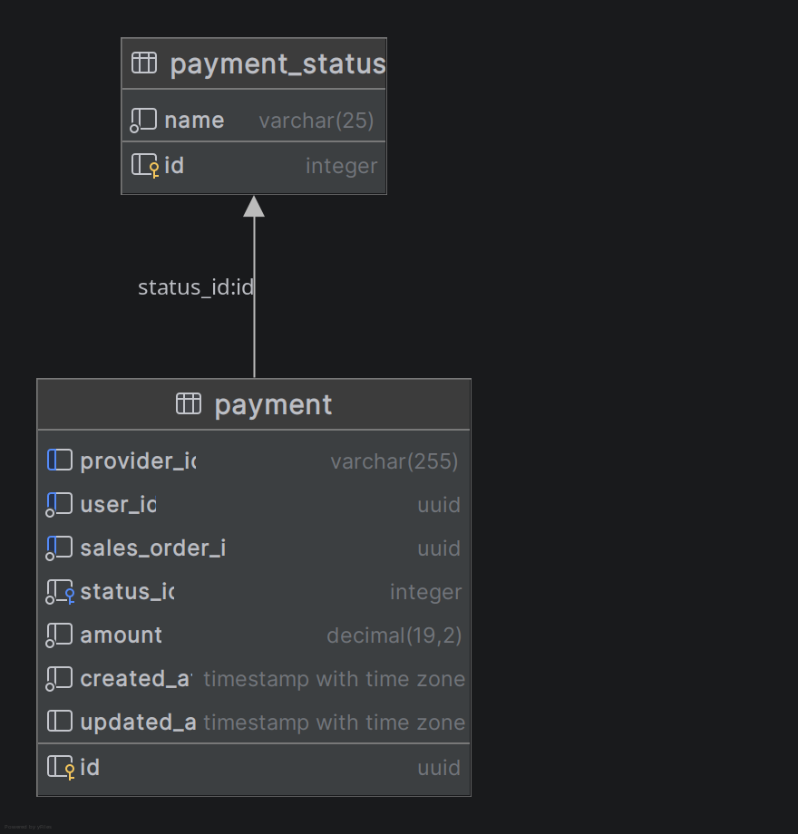

[« Home](../README.md)

# Payment Worker

Service to mock the payment operations.

## Stack

- Kotlin 2.3.21
- Spring Boot 4.x
- OpenAPI(Swagger)

## Database

### Stack

- PostgreSQL 17
- Flyway for migrations

### Entity Relationship Diagram

